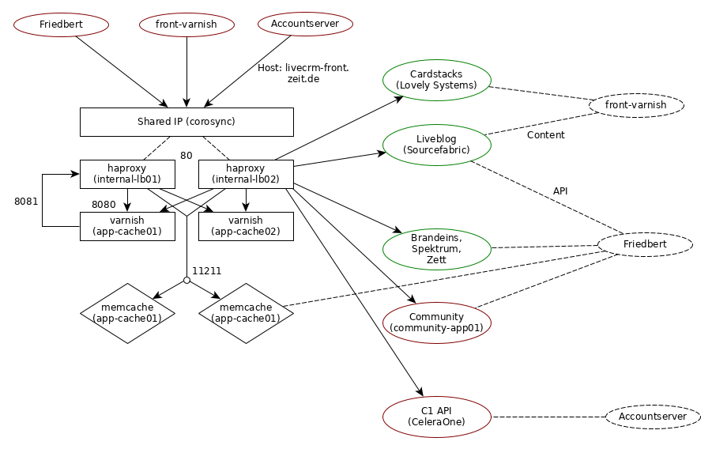

=========
Überblick
=========

Der ``internal-lb`` ist ein Loadbalancer, der RZ-interne HTTP-Requests zwischen unseren Diensten (sowie an 3rdparty-Dienste) bündelt.
Ein varnish ist vorhanden, um manche Dienste zu cachen und zu entlasten.
Außerdem steht ein memcache zur Verfügung (der von zeit.web fürs Caching genutzt wird).

Varnish dreht für seine Backends eine "Schleife" über den haproxy.
(Mit einem separaten Frontend auf Port 8081, um Endlosrekursion zu vermeiden.)
Das dient dazu, dass haproxy im Gegensatz zu varnish folgende Features bietet:

* HTTPS für Backends
* DNS periodisch neu auflösen (nicht nur beim VCL kompilieren)
